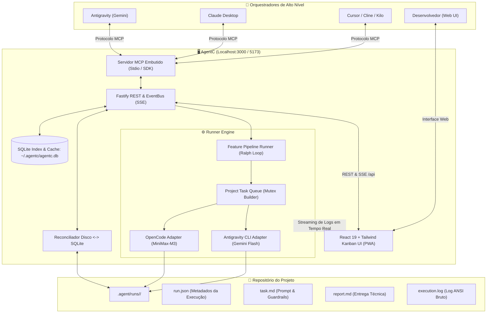

# AgentC ⚡

> **Central local-first de gerenciamento visual de tarefas e orquestração de desenvolvimento de software assistido por múltiplos agentes de IA.**

[](https://nodejs.org/)
[](https://www.typescriptlang.org/)
[](https://fastify.dev/)
[](https://react.dev/)
[](https://vitejs.dev/)
[](https://tailwindcss.com/)
[](https://modelcontextprotocol.io/)
[](https://sqlite.org/)

---

## 📌 Visão Geral

O **AgentC** é a ponte operacional e visual entre orquestradores de inteligência avançada (como Antigravity, Grok, Claude Desktop, Cursor e Cline) e subagentes operacionais eficientes executados via linha de comando (como OpenCode CLI com MiniMax-M3 ou Antigravity CLI com Gemini Flash).

Ele oferece ao desenvolvedor uma experiência de controle total (*Human-in-the-Loop*) por meio de uma interface visual Kanban moderna, com streaming de terminal em tempo real, visualização cirúrgica de diffs Git por tarefa, execução autônoma contínua de features (Ralph Loop) e persistência descentralizada diretamente no repositório do projeto.

---

## 💡 Princípios Fundamentais

1. **Local-First & Zero Bloat:** Sem dependência de nuvem, sem login obrigatório e sem telemetria invasiva. Todo o backend, banco de dados e execução rodam no seu `localhost`.
2. **O Disco é a Fonte da Verdade:** O estado principal de cada tarefa reside no próprio repositório do projeto em `.agent/runs/<run_id>/` (`run.json`, `task.md`, `report.md`, `execution.log`). O SQLite local opera como índice e cache de alta performance, reconciliado automaticamente com o disco.
3. **Desacoplamento de Executores (Multi-CLI):** Suporte extensível a múltiplos subagentes através do padrão *Runner Adapters* (OpenCode, Antigravity CLI), permitindo escolher o modelo mais rápido e econômico para cada contexto.
4. **Isolamento de Git e Segurança de Código:** Tarefas de escrita de código (`Builder`) contam com trava de fila sequencial (FIFO mutex por projeto) para prevenir conflitos de merge e arquivos sobrepostos. O diff gerado é cirúrgico, isolando apenas os arquivos modificados na respectiva execução.
5. **Proteção do Contexto dos Orquestradores:** O servidor MCP fornece respostas compactas e estruturadas (metadados, relatórios e estatísticas), nunca saturando a janela de contexto das LLMs com diffs desnecessariamente volumosos.

---

## 🚀 Principais Recursos

- **📋 Kanban Visual Multi-Projeto:**
  - Gerencie múltiplos repositórios simultaneamente a partir de um único painel.
  - Colunas intuitivas: `Backlog`, `Running`, `Review` e `Done`.
  - Badges visuais de modo (`Builder` vs `Scout`), runner, modelo e pulso de atividade ao vivo.

- **🔄 Esteira Autônoma de Features (Feature Pipeline Runner / Ralph Loop):**
  - Execução contínua de tarefas encadeadas por feature via `order_index`.
  - Quality Gates determinísticos com `verify_command` (ex: `npm run build && npm test`).
  - *Circuit Breaker* inteligente: pausa a esteira imediatamente em caso de falha de teste ou saída não-zero, poupando tokens e prevenindo cascata de erros.
  - Desacoplamento assíncrono total via MCP (`agentc_start_feature` com `wait: false`), eliminando timeouts de LLM.

- **⚡ Inspeção Completa da Tarefa (Drawer Lateral):**
  - **Terminal ANSI:** Streaming em tempo real via Server-Sent Events (SSE) com auto-scroll e cópia de logs.
  - **Relatório Markdown:** Visualização renderizada do `report.md` produzido pelo subagente.
  - **Diff Cirúrgico:** Comparação visual colorida destacando estritamente os arquivos afetados pela run.
  - **Especificação:** Leitura do prompt e guardrails originais (`task.md`).
  - **Retomada com Feedback (-Resume):** Correção ou iteração interativa fornecendo novas instruções ao worker na mesma sessão.

- **🔌 Servidor MCP Embutido (12 Ferramentas):**
  - Integração nativa com Antigravity, Claude Desktop, Cursor, Cline, Kilo Code e Roo Code.
  - Descoberta automática de projetos a partir do diretório de trabalho (`cwd`).

- **📱 Suporte a PWA & Serviço de Segundo Plano no Windows:**
  - Instalação como Progressive Web App (PWA) direto do navegador.
  - Banners de status e reconexão automática com fallback offline.
  - Utilitários para instalação silenciosa como Serviço do Windows (`service/`).

---

## 🏗️ Arquitetura do Sistema



---

## 📂 Estrutura do Repositório

```text
agentc/
├── server/                          # Backend Fastify, Banco SQLite, Engine e Servidor MCP
│   ├── src/
│   │   ├── config.ts               # Portas, caminhos do banco e limites
│   │   ├── db/                     # Conexão SQLite, schema DDL e repositórios
│   │   ├── events/                 # EventBus unificado para broadcasting SSE
│   │   ├── mcp/                    # Servidor MCP stdio e definição das 12 ferramentas
│   │   ├── reconciler/             # Auto-discovery e sincronização Disco <-> SQLite
│   │   ├── routes/                 # Endpoints REST (projects, tasks, board, logs, etc.)
│   │   ├── runner/                 # Gerenciador de processos, fila mutex e pipeline
│   │   │   ├── adapters/           # OpenCodeAdapter e AntigravityCliAdapter
│   │   │   ├── git.ts              # Captura de baseline e diff cirúrgico
│   │   │   ├── pipeline.ts         # Orquestrador autônomo de features
│   │   │   └── queue.ts            # Fila FIFO de tarefas por projeto
│   │   └── services/               # Instalador de harnesses/MCP para IDEs
│   ├── package.json
│   └── tsconfig.json
├── client/                          # Frontend React 19 + Vite + Tailwind CSS + PWA
│   ├── src/
│   │   ├── components/
│   │   │   ├── kanban/             # Board, Column, TaskCard, FeaturePipelineBar
│   │   │   ├── inspection/         # Drawer (Terminal, Report, Diff, TaskSpec)
│   │   │   ├── layout/             # Sidebar com contadores e Topbar
│   │   │   ├── modals/             # Modais de nova tarefa, projeto, MCP e CLIs
│   │   │   └── pwa/                # Banners de instalação, atualização e offline
│   │   ├── hooks/                  # useProjects, useBoard, useLiveLogs, useFeaturePipeline
│   │   └── services/               # Clientes da API REST e endpoints SSE
│   ├── package.json
│   └── vite.config.ts
├── service/                         # Configurações do Serviço do Windows em segundo plano
│   ├── AgentCService.cs            # Código C# do serviço nativo Windows
│   ├── instalar-servico.bat        # Compila e registra o serviço no Windows
│   ├── abrir-agentc.bat            # Inicia o serviço silenciosamente e abre o navegador
│   └── README.md                   # Documentação detalhada do serviço
├── .agent/                          # Configuração de skills para Antigravity
├── agentc.md                        # Diretrizes e arquitetura do projeto
├── design.md                        # Tokens e convenções de design da interface
├── spec.md                          # Especificação técnica detalhada (SPEC v2)
├── AgentC.exe                       # Launcher C# nativo para inicialização rápida no Windows
├── iniciar-agentc.bat               # Script batch para inicialização via terminal
├── package.json                     # Monorepo workspaces (server + client)
└── tsconfig.json
```

---

## 📦 Pré-requisitos

- **Node.js:** Versão `>= 20.0.0`
- **npm:** Versão `>= 10.0.0`
- **Git:** Instalado e configurado no `PATH`
- **CLIs de Subagentes (Opcionais, conforme os runners desejados):**
  - [OpenCode CLI](https://github.com/opencode-ai) (para modelos como MiniMax-M3)
  - [Antigravity CLI (`agy`)](https://github.com/google) (para modelos Gemini 1.5/2.0 Flash)

---

## 🛠️ Instalação e Inicialização

### 1. Clonar o Repositório e Instalar Dependências
```bash
git clone <url-do-repositorio> agentc
cd agentc
npm install
```

### 2. Modo de Desenvolvimento (Ambiente Completo)
Inicia concorrentemente o servidor Fastify (`localhost:3000`) e a interface Vite (`localhost:5173`):
```bash
npm run dev
```

Acesse o painel no navegador: **`http://localhost:5173`**

### 3. Build de Produção
```bash
npm run build
```

---

## 🪟 Execução no Windows

O AgentC oferece três opções simples para inicialização no Windows:

### Opção A: Duplo Clique via Batch ou Executável
- Dê duplo clique em **`iniciar-agentc.bat`** ou **`AgentC.exe`**.
- O script iniciará o servidor e o frontend em segundo plano e abrirá automaticamente o navegador em `http://localhost:5173`.

### Opção B: Atalho no Desktop
- Execute o script PowerShell para criar um atalho na Área de Trabalho:
  ```powershell
  powershell -ExecutionPolicy Bypass -File criar-atalho.ps1
  ```

### Opção C: Serviço do Windows em Segundo Plano (Silencioso)
Para que o AgentC rode sem nenhuma janela de terminal aberta:
1. Abra a pasta `service/`.
2. Execute **`instalar-servico.bat`** como Administrador (ele compila `AgentCService.cs` nativamente com `csc.exe` e registra o serviço `AgentC`).
3. Para abrir o AgentC a qualquer momento, basta rodar **`service/abrir-agentc.bat`** (ele sobe o serviço se estiver parado e abre o navegador).
4. Consulte [service/README.md](service/README.md) para comandos de status, parada e desinstalação.

---

## 🤖 Integração com Orquestradores (MCP)

O AgentC possui um servidor MCP nativo via `stdio` pronto para se conectar às suas IDEs e ferramentas de IA favoritas.

### Executável do Servidor MCP
- **Caminho do script MCP:** `<caminho_do_agentc>/server/dist/mcp/cli.js`
- **Comando de execução:** `node <caminho_do_agentc>/server/dist/mcp/cli.js`
*(Lembre-se de compilar o servidor antes via `npm run build` ou `npm run build:server`)*.

### 1. Configuração no Claude Desktop (`claude_desktop_config.json`)
```json
{
  "mcpServers": {
    "agentc": {
      "command": "node",
      "args": ["D:/PROJETOS/agentc/server/dist/mcp/cli.js"]
    }
  }
}
```

### 2. Configuração no Antigravity / Cursor / Cline
No menu de configurações de MCP da sua ferramenta, adicione o servidor do AgentC com transporte `stdio`:
```json
{
  "agentc": {
    "command": "node",
    "args": ["D:/PROJETOS/agentc/server/dist/mcp/cli.js"]
  }
}
```

---

## 🧰 Catálogo de Ferramentas MCP

O servidor MCP expõe 12 ferramentas padronizadas para interação autônoma com orquestradores:

| Ferramenta | Descrição |
| :--- | :--- |
| `agentc_list_projects` | Lista todos os projetos cadastrados com métricas consolidadas de tarefas. |
| `agentc_register_project` | Cadastra um novo repositório a partir do seu caminho absoluto (`cwd`). |
| `agentc_create_plan` | Cadastra no Kanban uma lista de tarefas decompostas para uma feature, com ordenação automática (`order_index`) e comando de teste opcional (`verify_command`). |
| `agentc_get_board` | Consulta o estado resumido das colunas do Kanban de um projeto ou feature. |
| `agentc_start_task` | Dispara ou retoma (`resume`) a execução de uma tarefa isolada via subagente. |
| `agentc_get_task_outcome` | Obtém o resultado resumido de uma tarefa (status, diff stat, arquivos afetados e relatório Markdown). |
| `agentc_update_task_status`| Atualiza manualmente o status de uma tarefa (`done`, `backlog`, `review`). |
| `agentc_cancel_task` | Cancela uma tarefa em execução, encerrando a árvore de processos no SO. |
| `agentc_start_feature` | Inicia o pipeline autônomo da feature (desacoplado com `wait: false` por padrão). |
| `agentc_get_feature_status`| Retorna o progresso atual da esteira da feature (tarefa ativa, concluídas e pendentes). |
| `agentc_pause_feature` | Pausa a esteira autônoma de uma feature de forma graciosa após a tarefa atual. |
| `agentc_resume_feature` | Retoma a esteira autônoma de uma feature pausada. |

---

## 📁 Estrutura de uma Execução no Disco (`.agent/runs/`)

Cada tarefa disparada no AgentC cria uma pasta única e versionada dentro do projeto gerenciado:

```text
<seu-projeto>/
└── .agent/
    └── runs/
        └── <run_id>/                    # Ex: 20260927_143000_auth_jwt
            ├── run.json                 # Metadados completos da execução
            ├── task.md                  # Instruções de prompt e guardrails
            ├── report.md                # Relatório técnico entregue pelo subagente
            └── execution.log            # Captura bruta do terminal (ANSI)
```

### Exemplo de `run.json`:
```json
{
  "id": "run_20260927_143000",
  "title": "Criar autenticação JWT e middleware de sessão",
  "feature": "auth-jwt",
  "mode": "Builder",
  "status": "review",
  "runner": "opencode",
  "model": "minimax/MiniMax-M3",
  "order_index": 0,
  "verify_command": "npm run test:auth",
  "git_baseline": {
    "commit": "8f2a1b9c",
    "dirty_files_before": []
  },
  "affected_files": [
    "src/routes/auth.ts",
    "src/middlewares/auth.ts"
  ],
  "exit_code": 0,
  "created_at": "2026-09-27T14:30:00.000Z",
  "started_at": "2026-09-27T14:30:05.000Z",
  "completed_at": "2026-09-27T14:33:10.000Z"
}
```

---

## 📜 Scripts do Projeto

No diretório raiz:
- `npm run dev`: Executa simultaneamente backend e frontend em modo de desenvolvimento.
- `npm run build`: Compila TypeScript no backend e gera o bundle de produção do frontend.
- `npm run dev:server`: Roda apenas o backend com live-reload (`tsx watch`).
- `npm run dev:client`: Roda apenas o frontend via Vite.
- `npm run build:server`: Compila o backend e sincroniza o schema SQLite.
- `npm run build:client`: Compila e empacota o frontend React.
- `npm run test:server`: Executa o teste de ciclo de vida e ferramentas MCP.
- `npm run mcp`: Executa o servidor MCP diretamente em modo CLI stdio.

---

## 📄 Licença

Distribuído sob licença proprietária/MIT para uso local e privado. Consulte a documentação interna para mais diretrizes.
