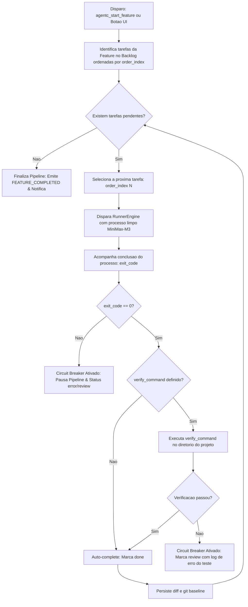

# Especificação Técnica de Implementação — AgentC (SPEC v2)

## 1. Visão Geral do Sistema
O **AgentC** é uma aplicação local-first voltada para a gestão, visualização e orquestração de desenvolvimento de software assistido por IA. Ele opera como o elo de coordenação entre:
1. **Orquestradores de Alto Raciocínio (High-Intelligence):** Antigravity (Gemini), Grok ou Claude Desktop, que realizam análise arquitetural, especificações, decomposição de tarefas e refinamento.
2. **Subagentes Operacionais Multi-CLI (Cost-Effective / Targeted):** Ferramentas autônomas desacopladas via *Adapters* (MiniMax-M3 via OpenCode CLI, Gemini 1.5/2.0 Flash via Antigravity CLI).
3. **Desenvolvedor Humano:** Interface visual Kanban com visão macro multi-projeto, streaming de logs ao vivo (SSE), inspeção de diffs direcionados e controle de aprovação (*Human-in-the-Loop*).

```mermaid
flowchart TD
    subgraph Orquestradores ["🧠 Orquestradores de Alto Nível"]
        Gemini["Antigravity (Gemini)"]
        Grok["Grok CLI / Harness"]
        Human["Desenvolvedor (Web UI)"]
    end

    subgraph AgentC ["🖥️ AgentC (Localhost:3000)"]
        MCP["MCP Server Embutido"]
        API["Fastify REST & SSE API"]
        DB[(SQLite Index & Cache)]
        Reconciler["Disk-DB Reconciler"]
        
        subgraph Engine ["⚙️ Runner Engine (Adapters)"]
            Queue["Project Task Queue (Mutex Builder)"]
            AdapterOpenCode["OpenCode Adapter (MiniMax-M3)"]
            AdapterAGY["Antigravity CLI Adapter (Gemini Flash)"]
        end

        UI["React + Tailwind Kanban UI"]
    end

    subgraph Repositorio ["📁 Repositório do Projeto"]
        RunFolder[".agent/runs/<run_id>/"]
        RunJSON["run.json (Metadados)"]
        TaskMD["task.md (Instruções)"]
        ReportMD["report.md (Entrega)"]
        LogFile["execution.log (ANSI Raw)"]
    end

    Gemini <-->|MCP Protocol (cwd auto-discovery)| MCP
    Grok <-->|REST API / MCP| MCP
    Human <-->|Web UI| UI
    UI <--> API
    MCP <--> API
    API <--> DB
    API <--> Reconciler
    Reconciler <--> RunFolder
    API --> Queue
    Queue --> AdapterOpenCode
    Queue --> AdapterAGY
    AdapterOpenCode --> RunFolder
    AdapterAGY --> RunFolder
    Engine -->|Logs em Tempo Real (SSE)| UI
```

---

## 2. Modelo de Dados e Persistência Híbrida

### A. O Disco como Fonte Primária da Verdade (`.agent/runs/`)
Toda tarefa gerenciada pelo AgentC possui diretório próprio no repositório do projeto, garantindo 100% de portabilidade e persistência mesmo sem o AgentC em execução.

```text
<caminho_do_projeto>/
└── .agent/
    ├── skills/                          # Skills do projeto (versionadas no Git)
    └── runs/                            # Histórico local de tarefas
        ├── .gitignore                   # (* e !.gitignore)
        └── <run_id>/                    # Ex: 20260921_103000_auth_jwt
            ├── run.json                 # Metadados de máquina (status, hashes, runner, tempos)
            ├── task.md                  # Prompt puro + Guardrails (Markdown limpo para a LLM)
            ├── report.md                # Entrega técnica gerada pelo subagente
            └── execution.log            # Cópia bruta de terminal gerada no streaming
```

#### Estrutura Canônica do `run.json`:
```json
{
  "id": "run_20260921_103000",
  "title": "Implementar endpoint de autenticação JWT",
  "mode": "Builder",
  "status": "review",
  "runner": "opencode",
  "model": "minimax/MiniMax-M3",
  "session_id": "ses_01j8m4k2...",
  "git_baseline": {
    "commit": "a1b2c3d4",
    "dirty_files_before": []
  },
  "affected_files": [
    "src/routes/auth.ts",
    "src/services/jwt.ts"
  ],
  "exit_code": 0,
  "created_at": "2026-09-21T10:30:00.000Z",
  "started_at": "2026-09-21T10:30:05.000Z",
  "completed_at": "2026-09-21T10:33:20.000Z"
}
```

### B. SQLite Local (`agentc.db` - Cache e Índice de Performance)
O banco SQLite atua como índice ultrarrápido para carregamento de boards, contadores globais e buscas sem ler a árvore do disco em cada requisição.

#### Schema DDL:
```sql
CREATE TABLE IF NOT EXISTS projects (
    id TEXT PRIMARY KEY,
    name TEXT NOT NULL,
    path TEXT NOT NULL UNIQUE,
    created_at DATETIME DEFAULT CURRENT_TIMESTAMP,
    updated_at DATETIME DEFAULT CURRENT_TIMESTAMP
);

CREATE TABLE IF NOT EXISTS tasks (
    id TEXT PRIMARY KEY,
    project_id TEXT NOT NULL REFERENCES projects(id) ON DELETE CASCADE,
    run_id TEXT NOT NULL,
    title TEXT NOT NULL,
    mode TEXT NOT NULL CHECK(mode IN ('Builder', 'Scout')),
    status TEXT NOT NULL CHECK(status IN ('backlog', 'running', 'review', 'done', 'error')),
    runner TEXT NOT NULL DEFAULT 'opencode',
    model TEXT NOT NULL DEFAULT 'minimax/MiniMax-M3',
    session_id TEXT,
    git_baseline_commit TEXT,
    affected_files TEXT,           -- JSON Array serializado de caminhos relativos
    feedback_prompt TEXT,          -- Última instrução de refinamento passada ao -Resume
    exit_code INTEGER,
    created_at DATETIME DEFAULT CURRENT_TIMESTAMP,
    started_at DATETIME,
    completed_at DATETIME,
    UNIQUE(project_id, run_id)
);

CREATE INDEX IF NOT EXISTS idx_tasks_project_status ON tasks(project_id, status);
```

### C. Reconciliação Bidirecional (Auto-Discovery)
Sempre que a rota `GET /api/projects/:id/board` é consultada (ou via evento de polling/inotify):
1. O backend compara os subdiretórios em `.agent/runs/` com os registros da tabela `tasks`.
2. Pastas recém-criadas com `run.json` (por exemplo, tarefas disparadas via CLI externa) são indexadas no SQLite instantaneamente.
3. Se um `run.json` no disco teve seu status alterado externamente, o cache SQLite é atualizado.

---

## 3. Motor de Execução & Arquitetura de Adapters

### A. Padrão Adapter para Desacoplamento de CLIs
Para evitar a dependência rígida de scripts intermediários do PowerShell e suportar múltiplas ferramentas de subagentes, o backend utiliza um padrão de **Runner Adapters**:

```typescript
export interface RunConfig {
  runId: string;
  projectPath: string;
  mode: 'Builder' | 'Scout';
  runner: 'opencode' | 'antigravity-cli';
  model: string;
  resume?: boolean;
  sessionId?: string;
  feedbackPrompt?: string;
}

export interface RunnerAdapter {
  name: string;
  spawn(config: RunConfig, onChunk: (data: string) => void): Promise<{ exitCode: number; sessionId?: string }>;
  kill(runId: string): Promise<void>;
}
```

1. **`OpenCodeAdapter`**:
   - Invoca diretamente `opencode run -m <model> --agent <plan|build> --dir <projectPath>` via `child_process.spawn`.
   - Se `resume` for true, anexa `-s <sessionId>` e passa o `feedbackPrompt`.
2. **`AntigravityCliAdapter`**:
   - Invoca a CLI local do Antigravity (`agy`) apontando para modelos da sua conta Pro (ex: Gemini 1.5 Flash ou 2.0 Flash) para tarefas cirúrgicas de código.
3. **`dispatch.ps1`**:
   - Mantido como utilitário autônomo na pasta da skill para uso direto pelo terminal sem necessidade de abrir a aplicação AgentC.

### B. Gestão de Concorrência & Travas de Segurança (Safety Locks)
Para prevenir corrupção de repositório e conflitos de mesclagem no Git:
- **Tarefas `Scout` (Read-Only):** Podem rodar em paralelo sem restrições (múltiplos scouts simultâneos para reconhecimento veloz).
- **Tarefas `Builder` (Escrita de Código):** Possuem trava sequencial (**FIFO Queue**) por projeto. Se uma tarefa Builder já estiver em status `running` no projeto `X`, a próxima Builder aguardará a conclusão ou aprovação da primeira, evitando colisões de arquivos.

### C. Captura Cirúrgica de Git Diff por Tarefa
Para que o diff mostre estritamente o que aquela tarefa produziu (sem misturar com alterações anteriores não commitadas):
1. **Pré-execução:** O AgentC grava no `run.json` o hash do commit atual (`git rev-parse HEAD`) e a lista de arquivos já modificados no repositório (`git status --porcelain`).
2. **Pós-execução:** O AgentC roda novamente `git status --porcelain`, calcula a diferença com o estado inicial e salva a lista exata em `affected_files`.
3. **Geração do Diff:**
   - Para a UI: `git diff HEAD -- <affected_files>` (renderização visual colorida).
   - Para o Antigravity (MCP): Sumário estatístico (`git diff --stat`) + `report.md`, sem saturar a janela de contexto com código cru.

---

## 4. Especificação da API REST Local (Fastify)

Porta padrão: `http://localhost:3000` (ou `3001`).

### Projetos & Descoberta
- `GET /api/projects`: Retorna todos os projetos cadastrados acompanhados de contadores de tarefas agregados (`backlog_count`, `running_count`, `review_count`).
- `POST /api/projects`: Cadastra novo projeto `{ name: string, path: string }`. Garante criação de `.agent/runs/` e `.gitignore`.
- `GET /api/projects/by-path?path=<absolute_path>`: Busca projeto pelo diretório (usado pelo MCP para auto-discovery a partir do `cwd`).
- `DELETE /api/projects/:id`: Remove o projeto do índice.

### Board e Tarefas
- `GET /api/projects/:id/board`: Retorna colunas (`backlog`, `running`, `review`, `done`) com auto-reconciliação de disco.
- `POST /api/projects/:id/tasks`: Cria nova tarefa e gera a pasta `.agent/runs/<run_id>/` com `run.json` e `task.md`.
  - Payload: `{ title, mode, runner, model, prompt, guardrails }`
- `PATCH /api/tasks/:id/status`: Altera o status manualmente (ex: mover para `done`).
- `GET /api/tasks/:id`: Retorna os dados completos da tarefa:
  - Metadados do `run.json`
  - Conteúdo de `task.md` e `report.md`
  - Lista de `affected_files` e o diff unificado direcionado
  - Últimos 100KB do `execution.log`

### Execução e Streaming
- `POST /api/tasks/:id/start`: Dispara o subagente.
  - Payload opcional: `{ resume?: boolean, feedback_prompt?: string }`
- `POST /api/tasks/:id/cancel`: Interrompe a execução ativa via encerramento de processos da árvore.
- `GET /api/tasks/:id/logs/stream`: Endpoint SSE (Server-Sent Events) transmitindo em tempo real cada chunk do terminal.

---

## 5. Especificação do Servidor MCP Embutido

O backend do AgentC executa um servidor MCP embutido para conexão direta com o Antigravity, Grok e outros orquestradores.

### 1. `agentc_list_projects`
Lista todos os projetos registrados no AgentC com suas estatísticas de tarefas.
- **Parâmetros:** Nenhum.
- **Retorno:** Lista de `{ id, name, path, running_tasks, review_tasks }`.

### 2. `agentc_register_project`
Registra automaticamente o projeto atual no AgentC a partir do `cwd` do orquestrador.
- **Parâmetros:**
  - `name` (string): Nome legível do projeto.
  - `project_path` (string): Caminho absoluto do repositório.
- **Retorno:** Dados do projeto cadastrado e confirmação.

### 3. `agentc_create_plan`
Permite ao orquestrador cadastrar o backlog decomposto diretamente no Kanban.
- **Parâmetros:**
  - `project_path` (string): Caminho do projeto.
  - `tasks` (array de objetos):
    - `title` (string): Título da tarefa.
    - `mode` ("Builder" | "Scout"): Modo de operação.
    - `runner` (string opcional, padrão: "opencode"): Ferramenta de execução.
    - `model` (string opcional, padrão: "minimax/MiniMax-M3"): Modelo alvo.
    - `prompt` (string): Objetivo detalhado da tarefa.
    - `guardrails` (string opcional): Restrições técnicas.
- **Retorno:** Confirmação com a lista de IDs criados.

### 4. `agentc_get_board`
Consulta o estado das tarefas no Kanban de um projeto.
- **Parâmetros:** `project_path` (string).
- **Retorno:** Resumo de cards agrupados por coluna.

### 5. `agentc_start_task`
Inicia ou retoma a execução de uma tarefa do Kanban.
- **Parâmetros:**
  - `project_path` (string)
  - `task_id` (string)
  - `resume` (boolean opcional): Se retoma a sessão anterior.
  - `feedback_prompt` (string opcional): Novas instruções corretivas para o worker.
- **Retorno:** Confirmação de início e status da fila.

### 6. `agentc_get_task_outcome`
Obtém o resultado consolidado e enxuto após o término da tarefa, **sem saturar o contexto do orquestrador com diffs volumosos**.
- **Parâmetros:** `project_path` (string), `task_id` (string).
- **Retorno:**
  - `status`: "review" | "done" | "error"
  - `exit_code`: número
  - `report_content`: texto do `report.md`
  - `affected_files`: lista de arquivos modificados
  - `diff_stat`: resumo de adições/remoções (`git diff --stat`)

---

## 6. Arquitetura do Frontend (React + Vite + Tailwind)

### Estrutura de Componentes
```text
client/src/
├── components/
│   ├── layout/
│   │   ├── Sidebar.tsx            # Projetos com contadores ao vivo (running/review)
│   │   └── Topbar.tsx             # Projeto ativo, status MCP/SSE e botão nova tarefa
│   ├── kanban/
│   │   ├── Board.tsx              # Container das 4 colunas com drag/drop ou cliques rápidos
│   │   ├── Column.tsx             # Coluna com badge de contagem
│   │   └── TaskCard.tsx           # Card compacto com badge de Runner/Model e pulso de execução
│   ├── inspection/
│   │   ├── InspectionDrawer.tsx   # Gaveta deslizante lateral
│   │   ├── TerminalViewer.tsx     # Terminal ANSI com auto-scroll e botão de cópia
│   │   ├── ReportViewer.tsx       # Renderizador de Markdown formatado
│   │   ├── TargetedDiffViewer.tsx # Diff visual estrito para arquivos daquela run
│   │   ├── TaskSpecViewer.tsx     # Visualizador de task.md e metadados de run.json
│   │   └── ResumeFeedbackModal.tsx# Modal para inserir feedback ao acionar -Resume
│   └── modals/
│       ├── NewProjectModal.tsx    # Modal de cadastro de projeto
│       └── NewTaskModal.tsx       # Criação de tarefa com seletor de Runner e Modelo
├── hooks/
│   ├── useProjects.ts             # Cache e polling de projetos
│   ├── useBoard.ts                # Estado reativo do Kanban
│   └── useLiveLogs.ts             # Consumo contínuo do stream SSE
└── App.tsx
```

---

## 7. Fases de Implementação e Roteiro

| Fase | Entregas Principais |
| :--- | :--- |
| **Fase 1: Core Engine & Adapters** | Servidor Fastify, banco SQLite, implementação do `run.json`, reconciliador de disco e `RunnerAdapter` com `OpenCodeAdapter`. Fila sequencial para Builders. |
| **Fase 2: Frontend Kanban & Live Logs** | Interface Vite + React + Tailwind, sidebar com contadores agregados por projeto, Kanban responsivo e streaming SSE no TerminalViewer. |
| **Fase 3: Inspeção, Retomada & Targeted Diff** | Gaveta de inspeção (Drawer) com `ReportViewer`, cálculo cirúrgico de `affected_files`, `TargetedDiffViewer` e fluxo de retomada com input de `feedback_prompt`. |
| **Fase 4: Multi-CLI & Servidor MCP** | Adição do `AntigravityCliAdapter` (Gemini Flash), implementação completa das 6 ferramentas MCP e validação do fluxo autônomo ponta a ponta. |
| **Fase 5: Feature Pipeline Runner (Ralph Loop)** | Automação sequencial ponta a ponta de módulos/features, ordenação (`order_index`), quality gates determinísticos (`verify_command`), circuit breaker de segurança e novas MCP tools (`agentc_start_feature`). |

---

## 8. Esteira de Execução Autônoma de Features (Feature Pipeline Runner & Ralph Loop)

### 8.1. Princípio Arquitetural
Inspirado no paradigma **Ralph Wiggum** (ciclos contínuos em instâncias efêmeras), o AgentC desacopla o **Agente Arquiteto** (Antigravity/LLM de Alto Raciocínio) do **Motor Executor Contínuo** (OpenCode + MiniMax-M3).

1. **Estado no Repositório & DB:** O progresso vive em `run.json`, `task.md`, `report.md`, `git status` e nos testes de software.
2. **Contexto Limpo por Tarefa:** Cada tarefa roda em um subprocesso CLI isolado, eliminando degradação de contexto e poluição da janela de chat do orquestrador.
3. **Desacoplamento de ACI (Zero MCP Timeout):** O orquestrador dispara a feature com `agentc_start_feature` em modo assíncrono/desacoplado (`wait: false`), retornando imediatamente. O loop avança sozinho localmente.

### 8.2. Extensão do Modelo de Dados
- **Tabela `tasks` / `RunJSON`:**
  - `order_index`: `INTEGER DEFAULT 0` (posição cronológica de execução dentro da feature).
  - `verify_command`: `TEXT` (comando de verificação determinístico opcional, ex: `npm run build && npm test`).
- **Estado do Pipeline em Memória & DB:**
  - `pipeline_status`: `'idle' | 'running' | 'paused' | 'completed' | 'failed'`
  - `current_task_id`: ID da tarefa atualmente em execução.

### 8.3. Ciclo de Vida do Pipeline (Máquina de Estados)


### 8.4. Quality Gates & Circuit Breaker
Para evitar a propagação de erros em cascata (trade-off de rodar tarefas autônomas sem intervenção humana):
1. **Verificação Determinística Local:** Se fornecido `verify_command`, o backend AgentC roda o comando diretamente no terminal antes de promover a tarefa para `done`.
2. **Circuit Breaker:** Se o worker falhar (`exit_code != 0`) ou o teste quebrar, o pipeline é pausado na hora. O AgentC emite o evento `PIPELINE_HALTED` no SSE e mantém a tarefa com erro para inspeção no Kanban, impedindo o desperdício de tokens nas tarefas subsequentes.

### 8.5. Novas Ferramentas MCP
1. `agentc_create_plan`: Atualizado para atribuir automaticamente `order_index = 0, 1, 2...` baseado na sequência do array de tarefas, com suporte a `verify_command`.
2. `agentc_start_feature`: Inicia a esteira autônoma da feature no projeto de forma desacoplada (`wait: false` por padrão) ou síncrona.
3. `agentc_get_feature_status`: Retorna o progresso consolidado do pipeline da feature (tarefas concluídas, ativa, pendentes e percentual de progresso).

### 8.6. Interface do Usuário (Kanban UI)
- **Tag de Ordem:** Cada card do Kanban exibe seu badge de sequência `#1`, `#2`, `#3` antes do título.
- **Ação Rápida por Feature:** Na barra de filtros, ao selecionar uma feature (ou no cabeçalho do grupo), exibe o botão `[▶ Executar Feature]` e `[⏹ Pausar]`.
- **Status Visual do Pipeline:** Banner ou badge animado indicando que a feature está em execução autônoma contínua.

